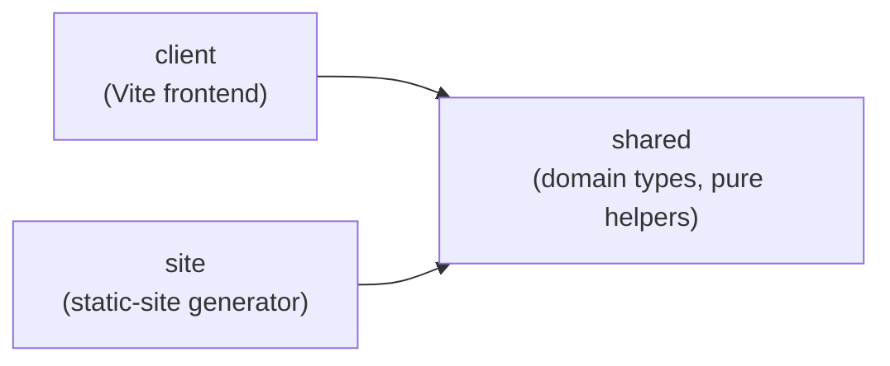

> Generated by /vibe:docs — manual edits will be overwritten; use README for hand-written content.

# Architecture

Kindle Nonograms is an npm workspaces monorepo. It pivoted from a full-stack (Express) architecture to a static-site generator — no runtime server is needed. It currently has three packages.

## `packages/shared`

Domain types and pure helpers used by the client (and, eventually, by the static-site generator). No dependencies.

- `Puzzle` — a nonogram's definition: `id`, `name`, `width`, `height`, `palette` (hex colors), and `cells` (the row-major solution grid; a cell's value is `null` or an index into `palette`). `createPuzzle(input)` validates and builds one, throwing a descriptive error on inconsistent input (empty id/name, non-positive dimensions, wrong row/column counts, out-of-range color indexes).
- `ClueRun` / `PuzzleClues` — a puzzle's clues (the numbers shown per row and column) are never stored, only derived on demand. `computeLineClues(line)` derives the runs for one row or column; `computePuzzleClues(puzzle)` derives both, transposed for columns. A run breaks on any color change, even without an empty cell between two different colors; two runs of the same color still need an empty gap to stay separate.
- `PlayerCellMark` / `PuzzleProgress` — a player's progress on a puzzle: one mark per cell (`number | "marked" | null`), same shape as the solution grid. `createEmptyProgressGrid(width, height)` builds a fresh one (every cell `null`). `isPuzzleSolved(puzzle, progress)` is true only when every solution-filled cell was marked with its exact color and no solution-empty cell was incorrectly filled; marks never affect the result either way.
- `BooleanGridExport` / `fromBooleanGridExport` — converts the sibling `remarkable-nonogram-generator` project's export shape (a boolean solution grid, no palette, no id) into a `Puzzle`: `true` cells become color index `0`, `false` cells become empty, and the palette is `["#000000"]`. The caller supplies the `id` (the export format carries none), which also becomes the puzzle name when the export's `name` is missing or blank. The result is validated through `createPuzzle`, so it throws the same descriptive errors on inconsistent input.

## `packages/client`

A vanilla TypeScript frontend (no framework), built with Vite. `src/main.ts` is the single entry point bundled for every generated page: it imports `hydratePlayPage.ts` and `hydrateLibraryPage.ts` purely for their side effects, since each already self-invokes on import and no-ops harmlessly when the markup it expects isn't on the current page — one shared bundle instead of a separate one per page shape (see `.vibe/decisions/007-static-site-build-orchestrator-design.md`).

`src/progressStorage.ts` persists a puzzle's `PuzzleProgress` (from `shared`) to `localStorage` under `kindle-nonograms:progress:<puzzleId>` via `saveProgress`/`loadProgress`. Both degrade silently — no throw, nothing saved/loaded — if storage is unavailable, throws (quota, restricted mode), or holds corrupted JSON. Its tests opt into a real DOM via a per-file `// @vitest-environment jsdom` pragma, since the rest of the suite defaults to the `node` environment.

`src/hydratePlayPage.ts` exposes `hydrate()`, the interactive entry point for a generated puzzle page (see `renderPuzzlePage` below). It parses the puzzle JSON embedded in the page, builds a Fill/Cross mode toggle (plus a color swatch per palette entry once there is more than one color) and a win banner, restores any saved progress onto the grid, and wires a single delegated click listener on the grid table. Each tap toggles that cell's mark, redraws only that `<td>` (never the whole grid, to avoid a visible flash on Kindle's slow e-ink refresh), persists progress via `progressStorage`, and shows/hides the win banner based on `isPuzzleSolved`. A filled cell is shown as a shape glyph (`● ▲ ■ ◆`, cycling by palette index) in the cell's palette color, and a crossed cell always shows a fixed `✖`, so the two states — and different colors — stay distinguishable even in grayscale (see `.vibe/decisions/005-play-page-hydration-builds-its-own-controls.md`). Saved progress with the wrong shape for the puzzle (e.g. from a corrupted or stale entry) is treated as no progress rather than crashing hydration.

`src/hydrateLibraryPage.ts` exposes `hydrate()`, the entry point for the generated home page. It reads every puzzle's full data embedded in the page (see `renderLibraryPage` below), checks each one's saved progress with `isPuzzleSolved`, and reveals the matching row's already-reserved `.solved-badge` node. A puzzle with no stored progress, incomplete or incorrect progress, or a corrupted/wrong-shaped stored entry is treated as not solved rather than marked or crashing hydration.

The Vite build targets `es2015` (see `packages/client/vite.config.ts`) — see [docs/configuration.md](configuration.md) if the target ever needs revisiting for a specific Kindle model's browser.

## `packages/site`

The static-site generator. `discoverPuzzles.ts` exposes `loadPuzzleSources(dir)`: it lists every `*.json` file in a directory, auto-detects whether each one is the project's native `Puzzle` shape or the sibling reMarkable project's export shape (by checking for a `palette` field), and validates it through `createPuzzle`/`fromBooleanGridExport` from `shared`. A puzzle's id always comes from its filename, even for native-shape files that carry their own `id` field, so id and filename can never drift apart (see `.vibe/decisions/001-puzzle-id-from-filename.md`). Loading fails fast: the first malformed or invalid file throws immediately, naming the file, rather than silently skipping it or returning a partial list.

`renderPuzzlePage.ts` exposes `renderPuzzlePage(puzzle)`: a pure function producing one puzzle's full static HTML page — clue numbers (from `computePuzzleClues`) above and to the left of a grid of empty, position-addressable `<td data-row data-col>` cells, and the puzzle embedded as JSON in a `` sequence can never break out of the tag), and `versionQuery` for appending an optional `?v=<hash>` to the client bundle's script `src`.

`build.ts` exposes `buildSite({ puzzlesDir, outDir })`, the orchestrator tying everything together into one output directory: it discovers and validates puzzles first (so a bad puzzle file fails the whole build before anything is written), wipes and recreates `outDir` itself, builds the client bundle via Vite's programmatic API — reusing `packages/client/vite.config.ts` as-is and only overriding `outDir`/the output filename, so there's one Kindle-target config, not two — at a fixed, unhashed path (`assets/main.js`, since the pages are rendered separately and can't know a content hash ahead of time), then renders the home page and one page per puzzle. Every generated page's bundle reference gets the same `?v=<hash>` query string, an 8-character hash of the bundle's own content computed once per build, so a returning browser doesn't keep serving a stale cached bundle after a rebuild (see `.vibe/decisions/007-static-site-build-orchestrator-design.md`). `build-cli.ts` is the thin script root `npm run build` runs, calling `buildSite` against `data/puzzles/` and `dist/`; root `npm run preview` serves that same `dist/` over local HTTP via Vite's own preview server.

## Deployment

`.github/workflows/deploy.yml` runs on every push to `main` (and manual dispatch): install, `npm run lint`, `npm test`, `npm run build`, then uploads the resulting `dist/` as a Pages artifact and deploys it via `actions/upload-pages-artifact`/`actions/deploy-pages`. Lint and tests run before the build, so a failure either way blocks the deploy rather than publishing a broken site. Since `data/puzzles/*.json` is committed, adding a puzzle is just: commit and push the file, and the site rebuilds and republishes automatically. `deploy-workflow.test.ts` (repo root) locks in the shape of this workflow — trigger, step ordering, and the `dist` output path — so it can't silently drift back to building the wrong directory.

## Why this split

Kindle's built-in browser is an old WebKit engine, so the client is kept framework-free and compiled to a conservative JS baseline. Domain logic (puzzle definitions, clue computation, progress tracking) lives in `shared`, isolated from any particular runtime, so it can be reused by whatever generates the static site.
