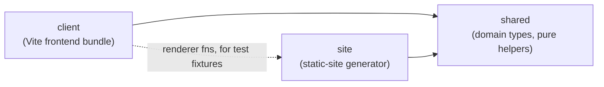
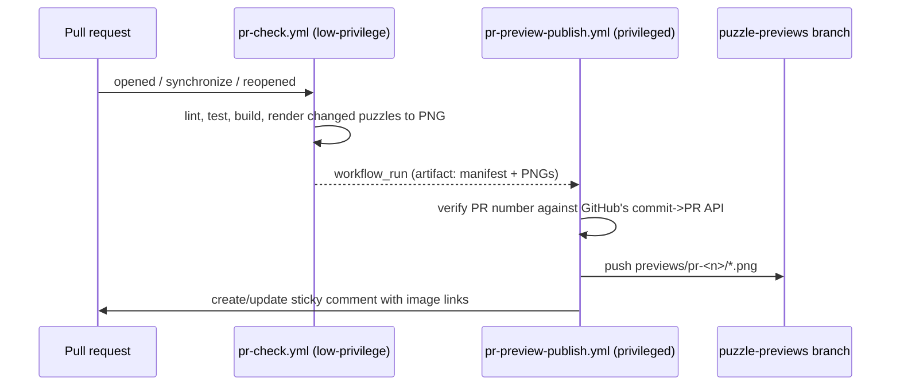

> Generated by /vibe:docs — manual edits will be overwritten; use README for hand-written content.

# Architecture

Kindle Nonograms is an npm workspaces monorepo. It pivoted from a full-stack (Express) architecture to a static-site generator — no runtime server is needed. It has three packages, plus a set of GitHub Actions workflows that build, deploy, and maintain the site.

`site` builds the pages that `client`'s bundle hydrates; `client` also imports `site`'s page-rendering functions (never the other way around for production code) purely to build accurate DOM fixtures in its own tests, so a test fixture can never silently drift out of sync with what the renderer actually produces.

## `packages/shared`

Domain types and pure helpers used by both `client` and `site`. No dependencies of its own.

- `Puzzle` — a nonogram's definition: `id`, `name`, `width`, `height`, `palette` (hex colors), and `cells` (the row-major solution grid; a cell's value is `null` or an index into `palette`). `createPuzzle(input)` validates and builds one, throwing a `PuzzleValidationError` on inconsistent input (empty id/name, non-positive dimensions, wrong row/column counts, out-of-range color indexes) — a plain-English `message` for developer-facing diagnostics, plus a stable `reason` discriminant (`"emptyId"`, `"emptyName"`, `"invalidDimensions"`, `"emptyPalette"`, `"rowCountMismatch"`, `"columnCountMismatch"`, `"colorIndexOutOfRange"`) a UI caller can switch on to pick its own translated message.
- `ClueRun` / `PuzzleClues` — a puzzle's clues (the numbers shown per row and column) are never stored, only derived on demand. `computeLineClues(line)` derives the runs for one row or column; `computePuzzleClues(puzzle)` derives both, transposed for columns. A run breaks on any color change, even without an empty cell between two different colors; two runs of the same color still need an empty gap to stay separate.
- `PlayerCellMark` / `PuzzleProgress` — a player's progress: one mark per cell (`number | "marked" | null`), same shape as the solution grid. `createEmptyProgressGrid(width, height)` builds a fresh one. `isPuzzleSolved(puzzle, progress)` is true only when every solution-filled cell was marked with its exact color and no solution-empty cell was incorrectly filled. `correctWrongCells(puzzle, progress)` returns a new grid with every cell that doesn't match the solution cleared back to untouched, sharing its per-cell correctness predicate with `isPuzzleSolved` so the two can never disagree; an untouched cell is never treated as a mistake, even where the solution requires a fill.
- `BooleanGridExport` / `fromBooleanGridExport` — converts the sibling `remarkable-nonogram-generator` project's export shape (a boolean solution grid, no palette, no id) into a `Puzzle`: `true` cells become color index `0`, `false` cells become empty, and the palette is `["#000000"]`. The caller supplies the `id`, which also becomes the puzzle's name when the export's own `name` is missing or blank.
- `Locale` / `TranslationKey` — the app's translation table: `SUPPORTED_LOCALES` (`"en"`, `"fr"`), `DEFAULT_LOCALE` (`"en"`), `translate(locale, key)`, falling back to `DEFAULT_LOCALE` for an unsupported locale rather than throwing. `isSupportedLocale(value)` narrows an arbitrary runtime value (a cookie, a browser header) to `Locale`. `LOCALE_COOKIE_NAME` also lives here so `client`'s `i18n.ts` and `site`'s `earlyLangScript.ts` read/write the exact same cookie name without either hardcoding a copy that could drift.
- `buildThumbnail(cells, maxDimension)` — pure nearest-neighbor downsample of a plain cell grid, capped so neither axis exceeds `maxDimension`; a single scale factor (from the longer axis) keeps the result's true proportions. Takes a grid rather than a `Puzzle` so it stays reusable beyond its current, sole caller: `site`'s PR-preview PNG renderer, which needs a bounded worst-case image size regardless of what dimensions a submitted puzzle claims. `client`'s library-page thumbnail no longer uses it — see `hydrateLibraryPage.ts` below and `.vibe/decisions/038-thumbnail-drops-downsampling-renders-every-cell.md`.
- `isMultiColorPuzzle(puzzle)` — pure function backing the library page's color filter, computed once by `site` at build time and read back client-side from a `data-color-type` attribute rather than recomputed in the browser.
- `checkSolvability(puzzle)` — a pure "no guessing required" fairness check: a fixpoint line-solver repeatedly derives every row's/column's forced cells from its clue (a dynamic-programming feasibility check per line, not placement enumeration, so it stays fast on large grids) until nothing changes. `ok: true` only if every cell ends up determined and matches the puzzle's own solution; on failure, names only the first problem found (row/column/cell), enough to reject a bad submission at build time. `diagnoseSolvability(puzzle)` runs the identical shared fixpoint engine but, on failure, names *every* row and column that couldn't be determined instead of stopping at the first, plus the exact list of ambiguous cells (`problemCells`) — built for the puzzle editor's live "check solvability" button, so a contributor sees the whole scope of an ambiguous area while still editing; a total function, never throws (see .vibe/decisions/040-editor-solvability-diagnosis-and-json-import.md). `suggestSolvabilityFix(puzzle)` — tries every other value at every cell `diagnoseSolvability` reports as ambiguous, re-checking full solvability after each trial via `checkSolvability`, and returns the first single-cell change that fixes it; only attempted when the ambiguous area has at most 6 cells and gives up after at most 40 trials regardless, both hard caps grounded in testing against the two real puzzles removed for requiring guessing (neither had any single-cell fix among ~130/~70 candidates tried) — see .vibe/decisions/041-solvability-single-cell-fix-suggestion-bounded.md. `isNativePuzzleShape(value)`/`parsePuzzleSource(value, id)` (`puzzleSourceParsing.ts`) — the one place native-vs-reMarkable puzzle JSON shape detection lives, reused by both `site`'s build-time loader and the editor's own JSON import so the two can never disagree on the same file; `id` always overrides any `id` the content declares. `computePuzzleDifficulty(puzzle)` scores a solvable puzzle 1-10 by how many rounds `checkSolvability`'s own fixpoint engine needs to converge (run once, not twice — it inlines the same "is this fully and correctly solved" check `checkSolvability` uses rather than calling it and re-running the whole line solver a second time), linearly mapped between a 2-round floor and a calibrated 32-round ceiling; `undefined` for a puzzle that isn't solvable this way at all (see .vibe/decisions/047-difficulty-score-from-fixpoint-rounds.md). `renderDifficultyBadge(score, locale?)` renders that score as a row of 5 filled/empty star glyphs (2 points per star), `aria-hidden`, paired with a `.sr-only` "Difficulty N/10" text equivalent — shared verbatim by `site`'s library/puzzle pages and `client`'s editor so all three can never render diverging markup for the same concept; `locale` defaults to English (corrected by the later `applyLocale()` sweep for anything baked into static HTML) but must be passed explicitly by a caller building this markup *after* that sweep already ran, e.g. the editor's on-demand solvability confirmation (see .vibe/decisions/048-difficulty-shown-as-star-row-not-digits.md).
- `findDuplicatePuzzle(puzzle, existing)` — returns the first puzzle in `existing` whose `width`/`height`/`cells` exactly match `puzzle`'s, ignoring `id`/`name`/`palette`.
- `contrastingTextColor(backgroundHex)` — picks black or white, whichever wins the WCAG contrast ratio against a background hex, falling back to black for a malformed color. Normalizes 3-digit shorthand (`#rgb`) and 8-digit alpha (`#rrggbbaa`, alpha byte ignored — a swatch always renders as an opaque fill) hex to 6-digit before computing contrast, so a puzzle palette color written in either format still gets the correct answer instead of the malformed-input fallback (backlog item 049). Shared by `site` (baking a swatch's checkmark color into static HTML) and `client` (rebuilding the same swatch at runtime) so the two can never pick different colors for the same input.
- `uiDefaults.ts` (`LIBRARY_PAGE_SIZE`, `PLAY_DEFAULT_MODE`, `PLAY_DEFAULT_ACTIVE_COLOR_INDEX`, `EDITOR_DEFAULT_WIDTH`/`HEIGHT`/`PALETTE`/`MODE`, `BORDER_WIDTH`) — plain constants naming every page's default UI state, plus the three border-width weights (`thin`/`medium`/`thick`) used across the app. `site` bakes each page's default chrome directly into its build-time HTML using these values, and `client` rebuilds that identical default at runtime for any later state change (e.g. a color swatch's border-width when the active color changes); kept in one shared place so the two sides can never silently disagree on what "default" means, or duplicate a runtime literal that could drift from it (backlog item 052).

## `packages/client`

A vanilla TypeScript frontend (no framework), built with Vite, `es2015` target. `src/main.ts` is the single entry point bundled for every generated page: it imports `hydrateLibraryPage.ts`, `hydratePlayPage.ts`, and `hydrateEditorPage.ts` purely for their side effects — each self-invokes on import and self-detects, by its own unique marker, whether it's on the right page, no-oping otherwise. One shared bundle serves every page shape instead of one bundle per shape. Each module also wraps its own self-invoked `hydrate()` call in a try/catch: a static `import` declaration can't itself be wrapped, so an uncaught error thrown while hydrating one page module is caught right there instead of halting the bundle's remaining synchronous execution and silently stopping the other two modules from ever getting imported (backlog item 041).

A page's default chrome — the puzzle page's toolbar/win banner/storage warning, the library page's filters/pagination, the editor's palette/toolbar/canvas — is now baked into the static HTML by `site`'s renderers in its exact default shape, rather than built from scratch by hydration on first load. Each `hydrate*.ts` module's job is to *locate* that already-existing markup by its `data-role` attributes and attach behavior to it; only a handful of controls whose true state is only known client-side (the win banner, solved badges, a revealed thumbnail) are still corrected after that, via a synchronous check before the page is perceived as painted — never a visible post-paint transition, which would fight the no-animation e-ink constraint. A missing expected control is always a defensive no-op scoped to just that control, never a thrown error that could dead-end the rest of hydration.

- `progressStorage.ts` — `saveProgress(puzzleId, progress): boolean` / `loadProgress(puzzleId): PuzzleProgress | undefined` persist/read progress to/from `localStorage`, under a key built by the also-exported `progressStorageKey(puzzleId)`. `loadProgress` degrades silently on failure or corrupted JSON; `saveProgress` reports a failed write back as `false` so a caller (the play page) can react instead of the loss going unnoticed.
- `openedStorage.ts` — `recordPuzzleOpened(puzzleId, timestampMs?)` / `loadPuzzleOpenedAt(puzzleId): number | undefined`, mirroring `progressStorage.ts`'s persistence pattern but in its own `kindle-nonograms:opened:*` key per puzzle, written independently of saved cell marks. `hydratePlayPage.ts` records the current time on every successful hydration (last open always wins); `hydrateLibraryPage.ts` reads it back to power the "recently opened" sort (backlog item 068).
- `cookieStorage.ts` — `readCookie(name)`/`writeCookie(name, value, maxAgeSeconds?)`, the generic cookie lookup/write primitive factored out from `i18n.ts` and `libraryFiltersStorage.ts` once both had independently implemented the identical loop; each still owns its own field-level encode/decode on top of this shared primitive.
- `i18n.ts` — `readLocaleCookie`/`writeLocaleCookie` (thin wrappers over `cookieStorage.ts`) persist the player's language choice to a `kindle-nonograms-locale` cookie, degrading silently if cookies are disabled. `resolveLocale(cookieValue, navigatorLanguage)` picks the effective locale (cookie, then browser language, then `DEFAULT_LOCALE`). `applyLocale(locale)` sets `document.documentElement.lang`, retranslates every `[data-i18n]` element's text in place, and retranslates every `[data-i18n-aria]` element's `aria-label` in place — with no reload and no DOM node created/removed/moved, so a focused element is never disturbed (see `.vibe/decisions/023-generic-aria-label-retranslation-attribute.md`). A translated `aria-label` containing a `{number}` token (e.g. the play page's numbered color swatches, and the puzzle editor's palette select/edit/remove controls) has that token substituted with the element's own 1-based `data-color-index`; a `{label}` token is substituted with the element's own current `textContent` (e.g. a puzzle link's visible name + dimensions, never itself translated); a `{status}` token is substituted with the translated `library.solvedBadge` word, reused rather than duplicated so a puzzle link's spoken solved status can never drift from the visible badge's own text. Each substitution is a no-op for any `[data-i18n-aria]` element whose translated string carries no such token (see `.vibe/decisions/029-swatch-aria-label-number-placeholder.md` and `.vibe/decisions/031-solved-link-aria-label-composes-badge-translation.md`).
- `libraryFiltersStorage.ts` — `readLibraryFiltersCookie`/`writeLibraryFiltersCookie` (also thin wrappers over `cookieStorage.ts`) persist the library page's color/status/sort selection to a single `kindle-nonograms-library-filters` cookie (a URL-querystring-shaped value: `color=...&status=...&sort=0|1`). Each field is validated and defaulted independently — the same tolerant, per-field spirit as `resolveLocale` above — so an old-shaped or hand-edited cookie never discards the whole saved preference, only the one field that doesn't parse; degrades silently (no throw, `undefined`/no-op) if cookies are disabled (backlog item 072).
- `fitGrid.ts` — `computeFitFontSizePx(...)`, a pure function computing the single `font-size` that scales an already `em`-sized grid to fit the available viewport space: the width fit ratio alone when `availableHeight` is omitted, or the smaller of the width/height fit ratios when it's given, a small safety margin, clamped and rounded down so a rounding error clips unused margin, never a real cell. `hydratePlayPage.ts` passes both (its fixed, no-scroll Kindle chrome has no room to grow taller than the viewport); `hydrateEditorPage.ts` passes width only — a normally-scrolling desktop page, a short browser window must never shrink its canvas just because height is scarce, the page simply grows taller and scrolls instead. Both pass the identical `minScale` floor — a concrete minimum legible font size (10px, derived as a ratio of the 16px base) rather than an arbitrary shrink limit — and `.grid-wrapper` uses `overflow:auto` (not `hidden`) so a puzzle that still doesn't fit at that floor scrolls instead of clipping or shrinking below legibility (backlog item 054, `.vibe/decisions/032-grid-legibility-floor-scrolls-instead-of-clipping.md`).
- `hydratePlayPage.ts` — the interactive entry point for a generated puzzle page, self-detecting via the embedded `#puzzle-data` script. Resolves the locale and calls `applyLocale` once (this page has no language switcher of its own — only the library and editor pages do). Records the current visit's timestamp via `openedStorage.ts` as soon as the puzzle data is confirmed valid. Locates the Cross toggle, Check button, and color swatches `site` already baked in (each swatch already carrying a numbered `aria-label`, e.g. "Color 2"), attaching click behavior and `aria-pressed` syncing without ever touching that label. A multi-color puzzle has no separate Fill button — any swatch tap itself switches the grid back into fill mode; a single-color puzzle, which renders no swatches, keeps an explicit Fill button as its only way back out of Cross mode (backlog item 070, `.vibe/decisions/035-single-color-play-page-keeps-an-explicit-fill-button.md`). Also locates the win banner (a missing one only disables win confirmation, the rest of hydration still attaches). If the embedded puzzle data exists but can't be read/parsed/validated into a `Puzzle`, it reveals the already-baked, hidden load-error message instead (`[data-role="load-error"]`, backlog item 040) and stops — no crash, no silently inert grid pretending to be interactive. Restores saved progress and wires one delegated click listener that toggles a tapped cell, redraws only that cell (never the whole grid, to avoid a visible flash on Kindle's slow e-ink refresh), saves progress, and shows/hides the win banner. If saved progress exists but no longer matches the puzzle's current dimensions (e.g. it was resized since last played), it's discarded for an empty grid and the already-baked, hidden "couldn't be restored" note is revealed once (`[data-role="restore-warning"]`, backlog item 042) — compatible progress keeps restoring completely silently. The Check button runs `correctWrongCells`, repaints only the cells it actually changed, and reveals the banner with the solved, "some wrong cells were cleared," or not-solved message as appropriate — it never fills in a cell the player hasn't attempted. Also locates the one-time "progress can't be saved" warning: the first failed `saveProgress` call this page view reveals it (tracked by an in-memory flag reset on every hydration, set synchronously so two failures in the same tick can't both slip through); a dismiss button hides it early without resetting that flag, so dismissing doesn't bring it back on a later failure. Finishes by calling `fitGrid.ts` to fit the grid to the viewport, re-run on resize and whenever the win banner or storage warning is first shown. Also listens for the browser's native `storage` event (fires in every other open tab on the same origin when `localStorage` changes, never in the tab that made the write) to keep two tabs open on the same puzzle in sync (backlog item 059): on a change to this puzzle's exact progress key, or a whole-storage `clear()` (`key === null`), it re-reads progress and repaints every grid cell in place (mutating the existing `<td>` nodes via the same per-cell paint used for a tap, never rebuilding the table) and refreshes the win banner's visibility/text the same way a tap does, re-fitting the grid only on a hidden→visible banner transition. The one-time storage-warning and restore-warning notes are deliberately left untouched by this resync — see `.vibe/decisions/037-cross-tab-progress-sync-scoped-to-grid-and-banner.md`.
- `hydrateLibraryPage.ts` — the entry point for the generated home page, self-detecting via the embedded `#puzzles-data` script. `readPuzzles()` treats a missing/empty script the same as a genuinely empty library (silently `[]`), but a script whose content fails to parse as JSON, or parses to something other than an array, is a corrupted build — that case still resolves to an empty list but logs a `console.warn` first, so a broken build doesn't look identical to a library with zero puzzles (backlog item 056). Locates the already-baked language switcher in the page footer, sets its value to the resolved locale and wires it, then applies that locale before checking whether the list is empty. If non-empty, computes each puzzle's solved/partial-progress state (reused from the badge/thumbnail logic below) and wires the already-baked color-filter (mono/multi, above the list) and status-filter (unsolved/in-progress/solved, below the list alongside the sort button — backlog item 072, `.vibe/decisions/045-secondary-filters-relocated-below-list.md`) toggle buttons, a "recently opened" sort toggle button, and Previous/Next pagination into one shared render pass: keeps only rows matching every active filter and inside the current page's slice, toggling `hidden` on the rest. Both filter groups share one `wireExclusiveToggle` helper (tapping the active button again clears that group back to "all", since plain toggle buttons can't otherwise hold the "all" state the way a `<select>` could — backlog item 067) instead of duplicating the interaction per group. Since a puzzle's solve status can only be known client-side (it reads saved progress), each row is tagged with a `data-status` attribute during this same setup pass, before the first render — unlike `data-color-type`, which `site` bakes server-side (`.vibe/decisions/044-status-filter-computed-client-side.md`). Toggling the sort button physically reorders the rows themselves (`Element.appendChild` relocates an already-attached node) — most-recently-opened first per `openedStorage.ts`'s stored timestamps, puzzles never opened kept after in their original relative order (a stable partition, not a comparator with a sentinel value) — captured once at setup so toggling the sort back off restores that exact original order; the filter/pagination logic then just reads whatever order the rows are currently in (backlog item 068). A saved cookie (`libraryFiltersStorage.ts`) restores the color/status/sort selection before the very first render, and every later change re-persists it — page number itself is never restored, always resetting to page 1 exactly like any other filter/sort change. Pagination is hidden entirely when the filtered result fits on one page. It then checks each puzzle's saved progress: a solved one reveals its `.solved-badge`, replaces its placeholder `.thumb` with a real preview built on the spot, and gets the puzzle link's own `aria-label` set to its visible text plus the translated solved status — the sibling badge span alone never reaches the link's accessible name, so tabbing link-to-link would otherwise never reveal solved status to a screen reader user (`.vibe/decisions/031-solved-link-aria-label-composes-badge-translation.md`). The preview itself renders every real cell of the grid — none merged, dropped, or point-sampled — with each cell's own on-screen square size computed as a fixed pixel budget divided by the puzzle's longer dimension, so even a puzzle far larger than the thumbnail box still shows its true detail, just at a proportionally smaller size (`.vibe/decisions/038-thumbnail-drops-downsampling-renders-every-cell.md`). A puzzle that isn't solved but has *some* actually-painted progress gets its own partial-progress preview instead — the same renderer fed the player's own marks (converted to the solution's cell shape; `"marked"`/untouched both become blank) rather than the solution — but never the solved badge or the accessible-name change; a puzzle with nothing actually painted (only marks, or no saved progress at all) keeps the neutral "?" placeholder (backlog item 071). An unsolved puzzle's link is left with no `aria-label` at all.
- `hydrateEditorPage.ts` — the interactive entry point for the puzzle editor (a contributor tool, self-detected by a `data-role="editor-page"` marker), plus the pure grid/palette/export logic it's built on (`createEmptyCells`/`resizeCells`/`paintCell`/`addPaletteColor`/`updatePaletteColor`/`removePaletteColor`/`buildPuzzleCandidate`/`triggerDownload`). Locates the already-baked language switcher in the page footer (same mechanism and footer placement as the library page — see `.vibe/decisions/022-editor-language-switcher-in-footer.md`), sets its value to the resolved locale, wires its `change` event to persist the cookie and call `applyLocale`, and keeps the resolved locale on its in-memory `EditorState` so later re-renders (resize, palette edit, import) keep using the chosen language via `translate(state.locale, …)` instead of reverting to English. On first load it does **not** rebuild the palette, toolbar, or grid canvas — that markup already exists in its default shape — it only attaches listeners to it, in three independently try-caught steps so a failure in one (e.g. the palette) never blocks the others (toolbar, grid fit) from attaching. `render()` remains the full rebuild path for every real state change afterward (resize, palette edit, a cell paint, an image import): unlike the play page's single-cell repaint, this fully re-renders the palette and grid every time — simple over clever, since this is a desktop authoring tool, not a Kindle e-ink page. Resizing is capped at 60 per axis (`EDITOR_MAX_DIMENSION`, shared with `renderEditorPage.ts`'s own `max` attribute, which is a hint only — the real enforcement is this range check) — a value outside `1..60` reports a fixed, translated message and reverts the field; a resulting grid at or above 625 cells reuses the image-import flow's own yield-then-disable pattern (disable the size inputs, show a plain "Resizing…" message, yield one frame, rebuild, then clear the message, re-enable, and restore focus to whichever field triggered it) so a large rebuild can no longer freeze the page with no feedback, while an ordinary smaller resize stays exactly as instant as before (backlog item 060, `.vibe/decisions/039-editor-resize-cap-and-cell-count-async-threshold.md`). Also wires a "JSON puzzle import" action (its own panel/status pair, `editor-import-json-*`) and a "check solvability" action (`editor-check-solvability`, its own error/confirmation pair) — see `.vibe/decisions/040-editor-solvability-diagnosis-and-json-import.md`. JSON import reads the picked file via `FileReader` (not the newer `File#text()`, which jsdom doesn't implement), parses it with `shared`'s `parsePuzzleSource` (auto-detecting native vs. reMarkable shape, id always from the file's own name), and — only if the result is structurally valid and within `EDITOR_MAX_DIMENSION` — replaces `state.width`/`height`/`palette`/`cells`/`name`/`filename` together; a rejected file leaves every field untouched. Deliberately checks only structural validity, never solvability: the point is to let a contributor reopen an already-broken puzzle file specifically to fix it with the solvability button, which importing it away entirely would defeat. That button runs `shared`'s `diagnoseSolvability` against the live draft (independent of Export's own name/filename validation) and reports every problem row/column 1-based, e.g. "Problem rows: 1, 2, 3", rather than the first one alone; when the ambiguous area is small enough, `shared`'s `suggestSolvabilityFix` result is appended as one more sentence naming a concrete row/column/value change that alone would fix it. When the draft passes, the confirmation region's `innerHTML` (not `textContent` — the only place in `client` that needs real markup rather than escaped text) also gets `shared`'s `renderDifficultyBadge`, called with the resolved `state.locale` explicitly rather than its English default: this content is built well after hydration's one-time page-wide translation sweep already ran, so it must already be in the right language the instant it appears rather than waiting for a sweep that won't run again until (if ever) the language is switched. Both new actions reuse the resize/import flows' yield-then-disable busy pattern (`RESIZE_ASYNC_THRESHOLD_CELLS`) for a large grid, so neither can freeze the page with no feedback. The grid canvas itself also grew a permanent `<thead>` row of 1-based column-number `<th>`s and a leading row-number `<th>` per body row (both `renderEditorPage.ts`'s static markup and this file's `renderGrid()` rebuild build the identical structure) — an inert `aria-hidden` corner cell where they meet, both header kinds carrying no `data-row`/`data-col`/`tabindex` so the roving-tabindex/keyboard logic stays entirely blind to them; each cell's own aria-label also gained a "Row R, column C" prefix (`cellAriaLabel`, substituted the same way the existing `{number}` token already is) so a screen-reader user gets the same benefit the visible headers give a sighted contributor (see .vibe/decisions/042-editor-grid-row-column-numbering.md). Export validates via `buildPuzzleCandidate`/`createPuzzle` and triggers a browser download of `<id>.json` on success, revealing a fixed, translated confirmation naming the downloaded file in a reserved region next to the Export button (`.vibe/decisions/028-export-confirmation-plain-text-teal.md`); on failure it maps the thrown `PuzzleValidationError`'s `reason` (never its raw `message`) to a fixed, translated, contributor-facing message in the current locale instead, falling back to one generic message for any reason the editor's own fields can't actually trigger — the confirmation and error regions are cleared and re-populated together on every export attempt, so only one ever holds text. An "import image" action decodes a picked file (`decodeImageFile.ts`, the one DOM-only piece of this pipeline — a throwaway `<canvas>`, kept isolated because jsdom can't render real pixels, verified instead against a real browser; every rejection is an `ImageDecodeError` with its own `reason`, mapped to a fixed translated message the same way) and feeds it through `imageQuantize.ts`'s pure `downsampleImage`/`quantizeColors`/`buildImportedGrid` (block-averaging downsample, dependency-free median-cut color quantization, background-color tolerance mapped to blank cells) using the grid's *current* width/height/palette-size read at the moment Import is clicked. The decode itself is raced against a fixed 15-second timeout via `withTimeout.ts` — a small, pure, directly unit-tested module kept separate from `decodeImageFile.ts` on purpose, so this generic race logic doesn't inherit that file's real-browser-only verification boundary; on timeout the decode is rejected with an `ImageDecodeError` of reason `"timeout"`, shown as a fixed translated message the same way as every other import failure, and the import controls are re-enabled exactly as after any other failed import (see `.vibe/decisions/027-image-import-timeout-race-lives-outside-decode.md`). All import feedback (missing file, bad palette size, an "Importing…" progress message, and every decode/timeout failure) lands in the Import section's own reserved status/error region right next to its controls, independent of the confirmation/error pair reserved next to Export — the two regions are never cross-cleared, so a leftover import message stays visible until the next import attempt even after an unrelated resize or export (see `.vibe/backlog/done/055-move-import-feedback-next-to-the-import-controls.md`). The paint canvas itself is fully keyboard-operable via a roving tabindex (`nextCellCoordinate(...)`, a pure function mapping a cell + arrow key + grid bounds to the clamped next cell): exactly one `<td>` is a Tab stop at a time, arrow keys move it (clamped at the edges, no wraparound), and Enter/Space paint/erase the focused cell through the same code path as a click. A single delegated `focusin` listener on the grid wrapper is the one place that updates which cell is current, so a mouse click, a Tab-in, and an arrow-key move can never disagree; on every `renderGrid()` rebuild the remembered current cell is clamped to the new dimensions and, if focus was actually inside the grid at rebuild time, restored to it. Each cell's `aria-label` states its current content ("Color N" or "Empty"), recomputed on every paint/erase (backlog item 058, `.vibe/decisions/034-editor-canvas-roving-tabindex-with-clamped-focus-preservation.md`).
- `htmlFixture.ts` — `extractBodyHtml(fullPageHtml)`, pulling a `<body>`'s inner markup out of a full page HTML string. Every `hydrate*.test.ts` fixture is built by calling `site`'s real `render*Page()` and feeding the result through this, rather than a hand-retyped copy that could silently drift out of sync.

The Vite build targets `es2015` (`packages/client/vite.config.ts`) — see [docs/configuration.md](configuration.md). The editor page is compiled to the same target for simplicity, even though it only really needs to run on a normal desktop browser.

## `packages/site`

The static-site generator: discovers/validates puzzle content, renders every page, and orchestrates the full build.

- `discoverPuzzles.ts` — `loadPuzzleSources(dir)` lists every `*.json` file in a directory and validates each one through `shared`'s `parsePuzzleSource` (auto-detects the project's own `Puzzle` shape vs. the reMarkable export shape). A puzzle's id always comes from its filename, even for files that carry their own `id` field. Beyond structural validation, each puzzle also passes `checkSolvability` (no guessing required) and `findDuplicatePuzzle` (checked against every puzzle already loaded earlier in the same listing). Loading fails fast, naming the offending file.
- `renderPuzzlePage.ts` — `renderPuzzlePage(puzzle)` produces one puzzle's full static HTML page: a header row with a static "back to library" link (works even before hydration runs or with JS disabled), clue numbers above/left of an empty, position-addressable grid, and the puzzle (including its full solution) embedded as JSON for later hydration — the site is static with no backend to hide the solution behind, so only the *visible* markup stays solution-blind. A multi-color puzzle's clue-run numbers are filled swatches (background = the run's palette color, text/border color = `contrastingTextColor(hex)`) rather than bordered text on white, and still carry a border style (solid/dashed/dotted/double, cycling by palette index) colored to match the text — not the fill — so the style stays visible against a same-hue background and clue runs stay legible and distinguishable even on grayscale e-ink (`.vibe/decisions/003-clue-color-plus-pattern-cue.md`, `.vibe/decisions/033-clue-run-fill-reuses-contrastingtextcolor-border-follows-text.md`). Also bakes in, in their default shape and hidden where relevant: the storage-failure warning, the restore-warning note shown once when incompatible saved progress is discarded (backlog item 042), the win banner, the load-error message shown if the embedded puzzle data ever turns out unreadable (backlog item 040), and the Cross/Check toolbar (including per-color swatches) — a Fill button is only baked in for a single-color puzzle, which has no swatches to take over that job (backlog item 070) — `hydratePlayPage.ts` only locates and attaches behavior to these, it builds none of them. The header's `.page-header-controls` slot also bakes in `shared`'s difficulty star badge (`renderDifficultyBadge`) whenever `computePuzzleDifficulty` can score the puzzle — empty for the rare puzzle it can't.
- `renderLibraryPage.ts` — `renderLibraryPage(puzzles)` produces the home page: one row per puzzle (visible markup shows only id/name/size), each carrying its `isMultiColorPuzzle` result as a `data-color-type` attribute and a reserved, hidden `.solved-badge` and placeholder `.thumb` for hydration to reveal. Every puzzle's full data is embedded as JSON so hydration can check saved progress. When the library is non-empty, also bakes the color-filter toggle buttons above the list — wrapped in a `role="group"` with both a small visible label and a matching `aria-label`, and each button's own `aria-label` additionally composes that group context in ("Color: Mono") since "Mono"/"Multi" alone isn't self-explanatory — a hidden "no puzzles match" message (now `role="status" aria-live="polite"`), then a second controls row (`data-role="library-secondary-filters"`) holding the status-filter toggle buttons (unsolved/in-progress/solved — self-explanatory on their own, so no composed per-button label needed) and the "recently opened" sort toggle button, placed *before* that "no puzzles match" message so a status/sort tap's own feedback never appears above the control just used, and finally Previous/Next pagination (given extra top margin so it reads as its own block, not part of the filter row above it), all in their default (nothing-filtered) shape — see backlog item 072, `.vibe/decisions/045-secondary-filters-relocated-below-list.md`. Ends with a static footer holding the language switcher (via `renderLanguageSwitcher.ts`), a "Create a puzzle" link, and a link to `CONTRIBUTING.md` on GitHub whose new-tab arrow stays `aria-hidden` but is now paired with a visually-hidden `.sr-only` span stating it opens in a new tab, so the link's accessible name carries that information too (backlog item 057). The link's own visible/accessible text is just the puzzle's name — its grid size lives solely in the meta row described next, never duplicated in the title. Each row also appends `shared`'s difficulty star badge, paired with the puzzle's own grid size (e.g. "16 × 16", real accessible text now that it's the fact's only copy), grouped as one adjacent unit inside a shared `.puzzle-meta-row` (`flex-basis:100%` plus a small `gap` and `margin-left:auto`, forcing the pair onto a fresh line, grouped rather than spread across it) under the name link and the "Solved" slot, whenever `computePuzzleDifficulty` can score that puzzle. `<li>` wraps its link/badge/meta-row content in a `.puzzle-card-body` sibling of the placeholder `.thumb`, switching `<li>` itself from `align-items:center` to `align-items:stretch` so the thumbnail's own unset cross-size stretches to match that body's full (one- or two-line) height automatically, rather than a fixed pixel height computed by hand — see `.vibe/decisions/050-grid-size-moves-out-of-the-title.md`.
- `renderEditorPage.ts` — `renderEditorPage()` produces the puzzle editor's static shell: a contributor authoring tool with no puzzle to render yet, so its palette editor, erase-mode toolbar button, and grid canvas are baked with real default markup (one black swatch, a 5×5 grid) rather than empty containers — there is no separate Paint button; tapping a swatch is itself what selects paint mode (backlog item 065) — `hydrateEditorPage.ts` only attaches behavior on first load. Each palette control's `aria-label` also carries a matching `data-i18n-aria` key (its accessible name isn't visible text, so the generic `data-i18n` mechanism alone can't retranslate it), and the select/edit/remove controls' labels each carry a `{number}` token so every color in the palette gets a distinct, position-numbered accessible name (e.g. "Select color 2") instead of an identical one repeated across the whole palette. Also ends with a static footer holding the language switcher (via `renderLanguageSwitcher.ts`), placed and styled exactly like the library page's own — see `.vibe/decisions/022-editor-language-switcher-in-footer.md`. Deliberately never renders either other page's own hydration marker (`#puzzle-data`/`#puzzles-data`), so it can never be mistaken for their shape. The grid canvas's `<table>`/`<tr>`/`<td>` also carry `role="grid"`/`"row"`/`"gridcell"` (labelled via `aria-labelledby` by the existing "Canvas" section heading) and a roving `tabindex`, so a screen reader's own browse-mode arrow keys don't collide with the app's own keyboard navigation while native row/column position stays exposed (backlog item 058).
- `renderLanguageSwitcher.ts` — `renderLanguageSwitcher()` produces the FR/EN `<select>` markup shared by the library and editor pages (English selected by default), so the two pages can never render diverging switcher markup.
- `earlyLangScript.ts` — `renderEarlyLangScript()` produces a tiny classic (non-module) inline `` can't break out), `versionQuery`.
- `imageQuantize.ts` / `decodeImageFile.ts` — the editor's image-import pipeline, described under `packages/client` above (the pure logic lives here in `site`, imported by `client`'s hydration).
- `build.ts` — `buildSite({ puzzlesDir, outDir })` discovers/validates puzzles first (a bad file fails the whole build before anything is written), wipes and recreates `outDir`, builds the client bundle via Vite's programmatic API at a fixed `assets/main.js` path (explicitly passing `publicDir` — Vite's own default resolves against `process.cwd()`, not this config's directory, so leaving it unset would silently drop `favicon.svg` from every build), then writes the home page, the editor page, and one page per puzzle, every reference to the bundle carrying the same content-hash version query string. `build-cli.ts` is the thin script `npm run build` runs, against `data/puzzles/` and `dist/`.
- `index.ts` — re-exports `renderLibraryPage`/`renderPuzzlePage`/`renderEditorPage` as the package's public entry point, so `client`'s tests can build real DOM fixtures instead of a hand-retyped copy.

### PR preview pipeline

A puzzle submitted or changed in a pull request gets an automatic image preview, without needing to pull the branch:

- `renderPuzzlePreviewPng`/`renderPreviewArtifact.ts` render one PNG per changed puzzle file with a dependency-free encoder built on `node:zlib` alone — no image/canvas library. A puzzle exceeding `maxGridDimension` is downsampled first via `shared`'s `buildThumbnail`.
- `previewFilenameGuard.ts`'s `sanitizePuzzleId` is the allowlist every manifest filename passes through before it can become a filesystem path.
- `previewPrTrust.ts`'s `isPrNumberAssociated` is the trust-chain check: the PR number an artifact declares is only acted on once independently confirmed against GitHub's own commit→PR association API — the low-privilege job that produced the artifact could otherwise have forged it.
- `previewPublishDecisions.ts` decides artifact mode (render vs. cleanup), finds the existing comment to edit, and skips a publish for an already-closed PR (guarding against a late run resurrecting a just-cleaned-up preview).
- `previewBranchGit.ts` does the actual git work against the orphan `puzzle-previews` branch.
- A daily scheduled sweep (`sweep-previews-cli.ts`, `previewSweepDecisions.ts`) is an independent backstop: it lists every open PR *before* checking out the branch (so a preview created in the gap between the two reads is only ever read as still-open), diffs that against every preview directory, and removes anything orphaned in one combined commit — a no-op when nothing is orphaned.

## Deployment

`.github/workflows/deploy.yml` runs on every push to `main`: install, lint, test, build, then publishes `dist/` to GitHub Pages. `pr-check.yml` runs the same install/lint/test/build sequence on every pull request (no deploy step, read-only permissions), plus the preview-render step described above. `pr-preview-publish.yml` is the privileged half of the preview pipeline. `sweep-previews.yml` is the daily backstop sweep. All four workflow files have their shape (trigger, step order, permissions, artifact names) locked in by a same-named `*-workflow.test.ts` at the repo root, so a workflow file can't silently drift out of the shape the rest of the pipeline assumes.

## Why this split

Kindle's built-in browser is an old WebKit engine, so the client is kept framework-free and compiled to a conservative JS baseline. Domain logic (puzzle definitions, clue computation, progress tracking, fairness/duplicate checks) lives in `shared`, isolated from any particular runtime, so both `client` and `site` can reuse it without either depending on the other for anything but rendering fixtures in tests.
