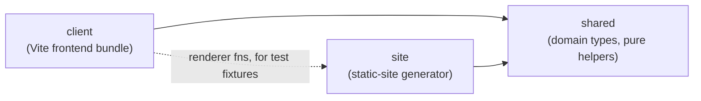
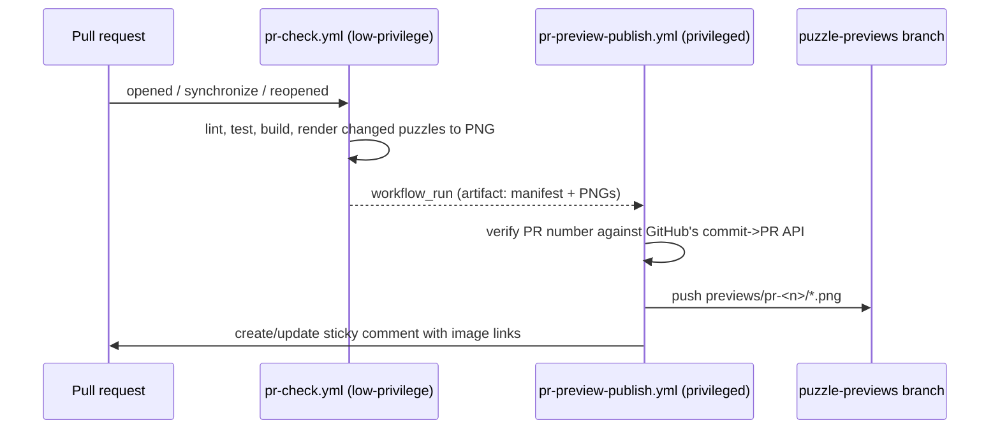

> Generated by /vibe:docs — manual edits will be overwritten; use README for hand-written content.

# Architecture

Kindle Nonograms is an npm workspaces monorepo. It pivoted from a full-stack (Express) architecture to a static-site generator — no runtime server is needed. It has three packages, plus a set of GitHub Actions workflows that build, deploy, and maintain the site.

`site` builds the pages that `client`'s bundle hydrates; `client` also imports `site`'s page-rendering functions (never the other way around for production code) purely to build accurate DOM fixtures in its own tests, so a test fixture can never silently drift out of sync with what the renderer actually produces.

## `packages/shared`

Domain types and pure helpers used by both `client` and `site`. No dependencies of its own.

- `Puzzle` — a nonogram's definition: `id`, `name`, `width`, `height`, `palette` (hex colors), and `cells` (the row-major solution grid; a cell's value is `null` or an index into `palette`). `createPuzzle(input)` validates and builds one, throwing a descriptive error on inconsistent input (empty id/name, non-positive dimensions, wrong row/column counts, out-of-range color indexes).
- `ClueRun` / `PuzzleClues` — a puzzle's clues (the numbers shown per row and column) are never stored, only derived on demand. `computeLineClues(line)` derives the runs for one row or column; `computePuzzleClues(puzzle)` derives both, transposed for columns. A run breaks on any color change, even without an empty cell between two different colors; two runs of the same color still need an empty gap to stay separate.
- `PlayerCellMark` / `PuzzleProgress` — a player's progress: one mark per cell (`number | "marked" | null`), same shape as the solution grid. `createEmptyProgressGrid(width, height)` builds a fresh one. `isPuzzleSolved(puzzle, progress)` is true only when every solution-filled cell was marked with its exact color and no solution-empty cell was incorrectly filled. `correctWrongCells(puzzle, progress)` returns a new grid with every cell that doesn't match the solution cleared back to untouched, sharing its per-cell correctness predicate with `isPuzzleSolved` so the two can never disagree; an untouched cell is never treated as a mistake, even where the solution requires a fill.
- `BooleanGridExport` / `fromBooleanGridExport` — converts the sibling `remarkable-nonogram-generator` project's export shape (a boolean solution grid, no palette, no id) into a `Puzzle`: `true` cells become color index `0`, `false` cells become empty, and the palette is `["#000000"]`. The caller supplies the `id`, which also becomes the puzzle's name when the export's own `name` is missing or blank.
- `Locale` / `TranslationKey` — the app's translation table: `SUPPORTED_LOCALES` (`"en"`, `"fr"`), `DEFAULT_LOCALE` (`"en"`), `translate(locale, key)`, falling back to `DEFAULT_LOCALE` for an unsupported locale rather than throwing. `isSupportedLocale(value)` narrows an arbitrary runtime value (a cookie, a browser header) to `Locale`.
- `buildThumbnail(puzzle, maxDimension)` — pure nearest-neighbor downsample of a puzzle's solution grid, capped so neither axis exceeds `maxDimension`; a single scale factor (from the longer axis) keeps the result's true proportions. Used only by `client`'s library-page hydration to build a solved puzzle's reveal thumbnail — never called server-side, so an unsolved puzzle's picture never sits in a page's HTML.
- `puzzleSizeBucket(puzzle)` / `isMultiColorPuzzle(puzzle)` — pure functions backing the library page's size and color filters, computed once by `site` at build time and read back client-side from `data-*` attributes rather than recomputed in the browser.
- `checkSolvability(puzzle)` — a pure "no guessing required" fairness check: a fixpoint line-solver repeatedly derives every row's/column's forced cells from its clue (a dynamic-programming feasibility check per line, not placement enumeration, so it stays fast on large grids) until nothing changes. `ok: true` only if every cell ends up determined and matches the puzzle's own solution.
- `findDuplicatePuzzle(puzzle, existing)` — returns the first puzzle in `existing` whose `width`/`height`/`cells` exactly match `puzzle`'s, ignoring `id`/`name`/`palette`.
- `contrastingTextColor(backgroundHex)` — picks black or white, whichever wins the WCAG contrast ratio against a background hex, falling back to black for a malformed color. Shared by `site` (baking a swatch's checkmark color into static HTML) and `client` (rebuilding the same swatch at runtime) so the two can never pick different colors for the same input.
- `uiDefaults.ts` (`LIBRARY_PAGE_SIZE`, `PLAY_DEFAULT_MODE`, `PLAY_DEFAULT_ACTIVE_COLOR_INDEX`, `EDITOR_DEFAULT_WIDTH`/`HEIGHT`/`PALETTE`/`MODE`) — plain constants naming every page's default UI state. `site` bakes each page's default chrome directly into its build-time HTML using these values, and `client` rebuilds that identical default at runtime for any later state change; kept in one shared place so the two sides can never silently disagree on what "default" means.

## `packages/client`

A vanilla TypeScript frontend (no framework), built with Vite, `es2015` target. `src/main.ts` is the single entry point bundled for every generated page: it imports `hydrateLibraryPage.ts`, `hydratePlayPage.ts`, and `hydrateEditorPage.ts` purely for their side effects — each self-invokes on import and self-detects, by its own unique marker, whether it's on the right page, no-oping otherwise. One shared bundle serves every page shape instead of one bundle per shape.

A page's default chrome — the puzzle page's toolbar/win banner/storage warning, the library page's filters/pagination, the editor's palette/toolbar/canvas — is now baked into the static HTML by `site`'s renderers in its exact default shape, rather than built from scratch by hydration on first load. Each `hydrate*.ts` module's job is to *locate* that already-existing markup by its `data-role` attributes and attach behavior to it; only a handful of controls whose true state is only known client-side (the win banner, solved badges, a revealed thumbnail) are still corrected after that, via a synchronous check before the page is perceived as painted — never a visible post-paint transition, which would fight the no-animation e-ink constraint. A missing expected control is always a defensive no-op scoped to just that control, never a thrown error that could dead-end the rest of hydration.

- `progressStorage.ts` — `saveProgress(puzzleId, progress): boolean` / `loadProgress(puzzleId): PuzzleProgress | undefined` persist/read progress to/from `localStorage`. `loadProgress` degrades silently on failure or corrupted JSON; `saveProgress` reports a failed write back as `false` so a caller (the play page) can react instead of the loss going unnoticed.
- `i18n.ts` — `readLocaleCookie`/`writeLocaleCookie` persist the player's language choice to a `kindle-nonograms-locale` cookie, degrading silently if cookies are disabled. `resolveLocale(cookieValue, navigatorLanguage)` picks the effective locale (cookie, then browser language, then `DEFAULT_LOCALE`). `applyLocale(locale)` sets `document.documentElement.lang` and retranslates every `[data-i18n]` element in place, with no reload.
- `fitGrid.ts` — `computeFitFontSizePx(...)`, a pure function computing the single `font-size` that scales an already `em`-sized grid to fit the available viewport space: the smaller of the width/height fit ratios, a small safety margin, clamped and rounded down so a rounding error clips unused margin, never a real cell.
- `hydratePlayPage.ts` — the interactive entry point for a generated puzzle page, self-detecting via the embedded `#puzzle-data` script. Resolves the locale and calls `applyLocale` once (this page has no language switcher of its own — only the library page does). Locates the Fill/Cross toggle, Check button, and color swatches `site` already baked in, attaching click behavior and `aria-pressed` syncing; locates the win banner (a missing one only disables win confirmation, the rest of hydration still attaches). Restores saved progress and wires one delegated click listener that toggles a tapped cell, redraws only that cell (never the whole grid, to avoid a visible flash on Kindle's slow e-ink refresh), saves progress, and shows/hides the win banner. The Check button runs `correctWrongCells`, repaints only the cells it actually changed, and reveals the banner with the solved, "some mistakes were fixed," or not-solved message as appropriate — it never fills in a cell the player hasn't attempted. Also locates the one-time "progress can't be saved" warning: the first failed `saveProgress` call this page view reveals it (tracked by an in-memory flag reset on every hydration, set synchronously so two failures in the same tick can't both slip through); a dismiss button hides it early without resetting that flag, so dismissing doesn't bring it back on a later failure. Finishes by calling `fitGrid.ts` to fit the grid to the viewport, re-run on resize and whenever the win banner or storage warning is first shown.
- `hydrateLibraryPage.ts` — the entry point for the generated home page, self-detecting via the embedded `#puzzles-data` script. Locates the already-baked language switcher in the page footer, sets its value to the resolved locale and wires it, then applies that locale before checking whether the list is empty. If non-empty, wires the already-baked size/color filter `<select>`s and Previous/Next pagination into one shared render pass: re-evaluates every row's `data-size-bucket`/`data-color-type` attributes with AND logic, keeps only rows inside the current page's slice, and toggles `hidden` on the rest — rows are never removed or reordered. A filter change resets to page 1; pagination is hidden entirely when the filtered result fits on one page. It then checks each puzzle's saved progress and, for each solved one, reveals its `.solved-badge` and replaces its placeholder `.thumb` with a real preview built on the spot from `shared`'s `buildThumbnail`.
- `hydrateEditorPage.ts` — the interactive entry point for the puzzle editor (a contributor tool, self-detected by a `data-role="editor-page"` marker), plus the pure grid/palette/export logic it's built on (`createEmptyCells`/`resizeCells`/`paintCell`/`addPaletteColor`/`updatePaletteColor`/`removePaletteColor`/`buildPuzzleCandidate`/`triggerDownload`). On first load it does **not** rebuild the palette, toolbar, or grid canvas — that markup already exists in its default shape — it only attaches listeners to it, in three independently try-caught steps so a failure in one (e.g. the palette) never blocks the others (toolbar, grid fit) from attaching. `render()` remains the full rebuild path for every real state change afterward (resize, palette edit, a cell paint, an image import): unlike the play page's single-cell repaint, this fully re-renders the palette and grid every time — simple over clever, since this is a desktop authoring tool, not a Kindle e-ink page. Export validates via `buildPuzzleCandidate`/`createPuzzle` and triggers a browser download of `<id>.json` on success, surfacing a thrown validation message inline otherwise. An "import image" action decodes a picked file (`decodeImageFile.ts`, the one DOM-only piece of this pipeline — a throwaway `<canvas>`, kept isolated because jsdom can't render real pixels, verified instead against a real browser) and feeds it through `imageQuantize.ts`'s pure `downsampleImage`/`quantizeColors`/`buildImportedGrid` (block-averaging downsample, dependency-free median-cut color quantization, background-color tolerance mapped to blank cells) using the grid's *current* width/height/palette-size read at the moment Import is clicked.
- `htmlFixture.ts` — `extractBodyHtml(fullPageHtml)`, pulling a `<body>`'s inner markup out of a full page HTML string. Every `hydrate*.test.ts` fixture is built by calling `site`'s real `render*Page()` and feeding the result through this, rather than a hand-retyped copy that could silently drift out of sync.

The Vite build targets `es2015` (`packages/client/vite.config.ts`) — see [docs/configuration.md](configuration.md). The editor page is compiled to the same target for simplicity, even though it only really needs to run on a normal desktop browser.

## `packages/site`

The static-site generator: discovers/validates puzzle content, renders every page, and orchestrates the full build.

- `discoverPuzzles.ts` — `loadPuzzleSources(dir)` lists every `*.json` file in a directory, auto-detects each one's shape (the project's own `Puzzle` shape vs. the reMarkable export shape, by checking for a `palette` field), and validates it through `shared`. A puzzle's id always comes from its filename, even for files that carry their own `id` field. Beyond structural validation, each puzzle also passes `checkSolvability` (no guessing required) and `findDuplicatePuzzle` (checked against every puzzle already loaded earlier in the same listing). Loading fails fast, naming the offending file.
- `renderPuzzlePage.ts` — `renderPuzzlePage(puzzle)` produces one puzzle's full static HTML page: a header row with a static "back to library" link (works even before hydration runs or with JS disabled), clue numbers above/left of an empty, position-addressable grid, and the puzzle (including its full solution) embedded as JSON for later hydration — the site is static with no backend to hide the solution behind, so only the *visible* markup stays solution-blind. Clue runs are distinguished by both color and a border style (solid/dashed/dotted/double) so they stay legible even on grayscale e-ink. Also bakes in, in their default shape and hidden where relevant: the storage-failure warning, the win banner, and the Fill/Cross/Check toolbar (including per-color swatches) — `hydratePlayPage.ts` only locates and attaches behavior to these, it builds none of them.
- `renderLibraryPage.ts` — `renderLibraryPage(puzzles)` produces the home page: one row per puzzle (visible markup shows only id/name/size), each carrying its `puzzleSizeBucket`/`isMultiColorPuzzle` result as `data-*` attributes and a reserved, hidden `.solved-badge` and placeholder `.thumb` for hydration to reveal. Every puzzle's full data is embedded as JSON so hydration can check saved progress. When the library is non-empty, also bakes the size/color filter bar, a hidden "no puzzles match" message, and Previous/Next pagination in their default shape. Ends with a static footer holding the language switcher, a "Create a puzzle" link, and a link to `CONTRIBUTING.md` on GitHub.
- `renderEditorPage.ts` — `renderEditorPage()` produces the puzzle editor's static shell: a contributor authoring tool with no puzzle to render yet, so its palette editor, paint/erase toolbar, and grid canvas are baked with real default markup (one black swatch, Paint mode, a 5×5 grid) rather than empty containers — `hydrateEditorPage.ts` only attaches behavior on first load. Deliberately never renders either other page's own hydration marker (`#puzzle-data`/`#puzzles-data`), so it can never be mistaken for their shape.
- `theme.ts` / `sharedStyles.ts` — plain TS constants (font stacks, the paper/panel neutral pair, the three-accent "cabinet" color system — amber for navigation/active toggles, magenta for the primary in-puzzle action, teal for "completed," deliberately never applied to the puzzle grid itself so it stays the calmest, most legible element) and the CSS fragment built from them, interpolated into literal `<style>` blocks at build time rather than CSS custom properties (`var()` support on Kindle's old WebKit is uncertain).
- `htmlEscape.ts` — `escapeHtml`, `embedJson` (safely serializes data into a `` can't break out), `versionQuery`.
- `imageQuantize.ts` / `decodeImageFile.ts` — the editor's image-import pipeline, described under `packages/client` above (the pure logic lives here in `site`, imported by `client`'s hydration).
- `build.ts` — `buildSite({ puzzlesDir, outDir })` discovers/validates puzzles first (a bad file fails the whole build before anything is written), wipes and recreates `outDir`, builds the client bundle via Vite's programmatic API at a fixed `assets/main.js` path (explicitly passing `publicDir` — Vite's own default resolves against `process.cwd()`, not this config's directory, so leaving it unset would silently drop `favicon.svg` from every build), then writes the home page, the editor page, and one page per puzzle, every reference to the bundle carrying the same content-hash version query string. `build-cli.ts` is the thin script `npm run build` runs, against `data/puzzles/` and `dist/`.
- `index.ts` — re-exports `renderLibraryPage`/`renderPuzzlePage`/`renderEditorPage` as the package's public entry point, so `client`'s tests can build real DOM fixtures instead of a hand-retyped copy.

### PR preview pipeline

A puzzle submitted or changed in a pull request gets an automatic image preview, without needing to pull the branch:

- `renderPuzzlePreviewPng`/`renderPreviewArtifact.ts` render one PNG per changed puzzle file with a dependency-free encoder built on `node:zlib` alone — no image/canvas library. A puzzle exceeding `maxGridDimension` is downsampled first via `shared`'s `buildThumbnail`.
- `previewFilenameGuard.ts`'s `sanitizePuzzleId` is the allowlist every manifest filename passes through before it can become a filesystem path.
- `previewPrTrust.ts`'s `isPrNumberAssociated` is the trust-chain check: the PR number an artifact declares is only acted on once independently confirmed against GitHub's own commit→PR association API — the low-privilege job that produced the artifact could otherwise have forged it.
- `previewPublishDecisions.ts` decides artifact mode (render vs. cleanup), finds the existing comment to edit, and skips a publish for an already-closed PR (guarding against a late run resurrecting a just-cleaned-up preview).
- `previewBranchGit.ts` does the actual git work against the orphan `puzzle-previews` branch.
- A daily scheduled sweep (`sweep-previews-cli.ts`, `previewSweepDecisions.ts`) is an independent backstop: it lists every open PR *before* checking out the branch (so a preview created in the gap between the two reads is only ever read as still-open), diffs that against every preview directory, and removes anything orphaned in one combined commit — a no-op when nothing is orphaned.

## Deployment

`.github/workflows/deploy.yml` runs on every push to `main`: install, lint, test, build, then publishes `dist/` to GitHub Pages. `pr-check.yml` runs the same install/lint/test/build sequence on every pull request (no deploy step, read-only permissions), plus the preview-render step described above. `pr-preview-publish.yml` is the privileged half of the preview pipeline. `sweep-previews.yml` is the daily backstop sweep. All four workflow files have their shape (trigger, step order, permissions, artifact names) locked in by a same-named `*-workflow.test.ts` at the repo root, so a workflow file can't silently drift out of the shape the rest of the pipeline assumes.

## Why this split

Kindle's built-in browser is an old WebKit engine, so the client is kept framework-free and compiled to a conservative JS baseline. Domain logic (puzzle definitions, clue computation, progress tracking, fairness/duplicate checks) lives in `shared`, isolated from any particular runtime, so both `client` and `site` can reuse it without either depending on the other for anything but rendering fixtures in tests.
