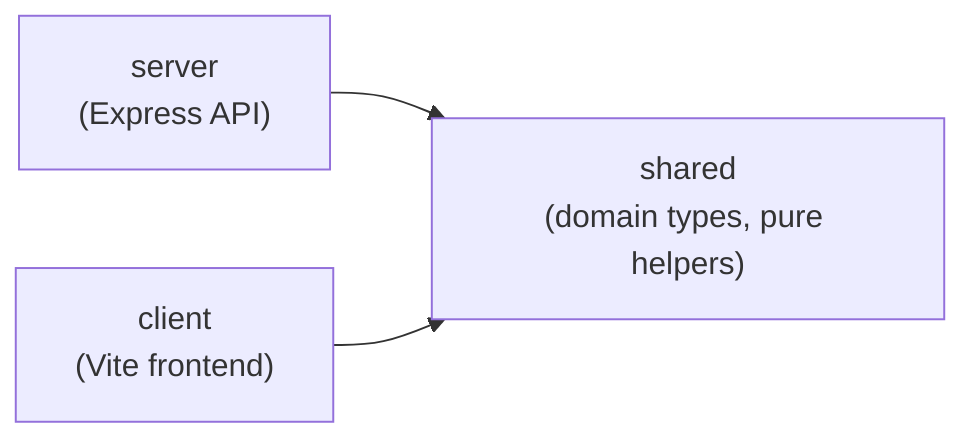

> Generated by /vibe:docs — manual edits will be overwritten; use README for hand-written content.

# Architecture

Kindle Nonograms is an npm workspaces monorepo with three packages.

## `packages/shared`

Domain types and pure helpers used by both the server and the client. No dependencies.

- `Puzzle` — a nonogram's definition: `id`, `name`, `width`, `height`, `palette` (hex colors), and `cells` (the row-major solution grid; a cell's value is `null` or an index into `palette`). `createPuzzle(input)` validates and builds one, throwing a descriptive error on inconsistent input (empty id/name, non-positive dimensions, wrong row/column counts, out-of-range color indexes).
- `ClueRun` / `PuzzleClues` — a puzzle's clues (the numbers shown per row and column) are never stored, only derived on demand. `computeLineClues(line)` derives the runs for one row or column; `computePuzzleClues(puzzle)` derives both, transposed for columns. A run breaks on any color change, even without an empty cell between two different colors; two runs of the same color still need an empty gap to stay separate.
- `PlayerCellMark` / `PuzzleProgress` — a player's progress on a puzzle: one mark per cell (`number | "marked" | null`), same shape as the solution grid. `createEmptyProgressGrid(width, height)` builds a fresh one (every cell `null`). `isPuzzleSolved(puzzle, progress)` is true only when every solution-filled cell was marked with its exact color and no solution-empty cell was incorrectly filled; marks never affect the result either way.

## `packages/server`

An Express API. The app is built by a factory function, `createApp()` in `src/app.ts`, kept separate from the code that starts listening (`src/index.ts`). This lets tests exercise the app with `supertest` without opening a real network port.

Currently exposes:

- `GET /api/health` — returns `{ "status": "ok" }`, used as a liveness check.

## `packages/client`

A vanilla TypeScript frontend (no framework), built with Vite. `src/main.ts` mounts into the `#app` element in `index.html`, guarded behind `typeof document !== "undefined"` so pure functions (like `formatClueLine`) stay unit-testable outside a browser.

The Vite build targets `es2015` (see `packages/client/vite.config.ts`) — see [docs/configuration.md](configuration.md) if the target ever needs revisiting for a specific Kindle model's browser.

## Why this split

Kindle's built-in browser is an old WebKit engine, so the client is kept framework-free and compiled to a conservative JS baseline. Domain logic that both the server and the client need (puzzle definitions, clue computation, progress tracking) lives in `shared` so the two sides can't drift apart.
