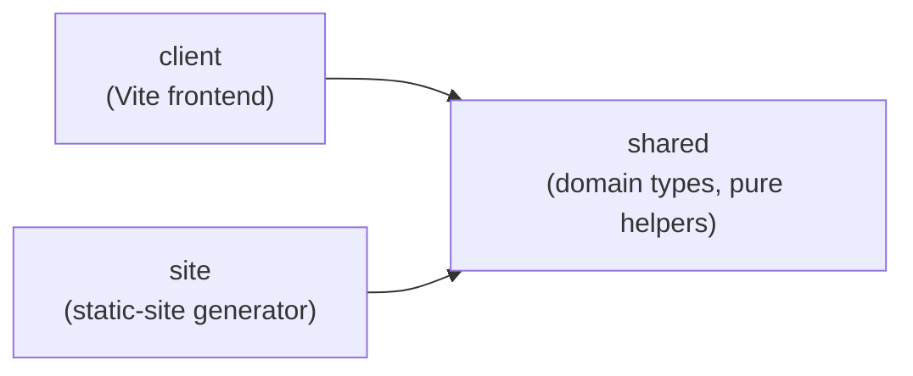

> Generated by /vibe:docs — manual edits will be overwritten; use README for hand-written content.

# Architecture

Kindle Nonograms is an npm workspaces monorepo. It pivoted from a full-stack (Express) architecture to a static-site generator — no runtime server is needed. It currently has three packages.

## `packages/shared`

Domain types and pure helpers used by the client (and, eventually, by the static-site generator). No dependencies.

- `Puzzle` — a nonogram's definition: `id`, `name`, `width`, `height`, `palette` (hex colors), and `cells` (the row-major solution grid; a cell's value is `null` or an index into `palette`). `createPuzzle(input)` validates and builds one, throwing a descriptive error on inconsistent input (empty id/name, non-positive dimensions, wrong row/column counts, out-of-range color indexes).
- `ClueRun` / `PuzzleClues` — a puzzle's clues (the numbers shown per row and column) are never stored, only derived on demand. `computeLineClues(line)` derives the runs for one row or column; `computePuzzleClues(puzzle)` derives both, transposed for columns. A run breaks on any color change, even without an empty cell between two different colors; two runs of the same color still need an empty gap to stay separate.
- `PlayerCellMark` / `PuzzleProgress` — a player's progress on a puzzle: one mark per cell (`number | "marked" | null`), same shape as the solution grid. `createEmptyProgressGrid(width, height)` builds a fresh one (every cell `null`). `isPuzzleSolved(puzzle, progress)` is true only when every solution-filled cell was marked with its exact color and no solution-empty cell was incorrectly filled; marks never affect the result either way.
- `BooleanGridExport` / `fromBooleanGridExport` — converts the sibling `remarkable-nonogram-generator` project's export shape (a boolean solution grid, no palette, no id) into a `Puzzle`: `true` cells become color index `0`, `false` cells become empty, and the palette is `["#000000"]`. The caller supplies the `id` (the export format carries none), which also becomes the puzzle name when the export's `name` is missing or blank. The result is validated through `createPuzzle`, so it throws the same descriptive errors on inconsistent input.
- `Locale` / `TranslationKey` — the app's translation table: `SUPPORTED_LOCALES` (`"en"`, `"fr"`), `DEFAULT_LOCALE` (`"en"`), and `translate(locale, key)` looking up one of every UI string's English/French renderings. `isSupportedLocale(value)` narrows an arbitrary runtime value (a cookie, a browser header) to `Locale`. `translate` falls back to `DEFAULT_LOCALE` for an unsupported locale rather than throwing (see `.vibe/decisions/008-i18n-translate-falls-back-to-default-locale.md`).
- `buildThumbnail(puzzle, maxDimension)` — a pure function downsampling a puzzle's solution grid to a small preview no larger than `maxDimension` on either axis, nearest-neighbor sampled and scaled by a single factor on both axes so the preview keeps the solution's true proportions instead of being squashed square. A puzzle already within the cap is returned unchanged. Used only by `client`'s library-page hydration to build a solved puzzle's reveal thumbnail — never called server-side (see `.vibe/decisions/012-solved-thumbnail-built-client-side-only.md`).
- `puzzleSizeBucket(puzzle)` / `isMultiColorPuzzle(puzzle)` — pure functions backing the library page's size and color filters. `puzzleSizeBucket` groups a puzzle into `"small"`/`"medium"`/`"large"` by its total cell count (`width * height`, thresholds at 100 and 400 cells, inclusive on the smaller bucket); `isMultiColorPuzzle` is `true` whenever `palette.length > 1`. Both are computed once, server-side, by `site`'s `renderLibraryPage.ts` and read back client-side by `client`'s `hydrateLibraryPage.ts` — never recomputed in the browser.
- `checkSolvability(puzzle)` — a pure "no guessing required" fairness check: a fixpoint line-solver repeatedly derives every row's and column's forced cells from its clue (a dynamic-programming feasibility check per line, not placement enumeration, so it stays fast even on large grids) until nothing new is forced. Returns `{ ok: true }` only if every cell ends up determined and matches the puzzle's own solution, otherwise `{ ok: false, reason }` (see `.vibe/decisions/016-line-solver-fairness-check.md`).
- `findDuplicatePuzzle(puzzle, existing)` — a pure function returning the first puzzle in `existing` whose dimensions and cell grid exactly match `puzzle`'s, or `undefined`. Compares solution content only, never `id`/`name`/`palette`, so the same picture resubmitted under a different name is still caught.

## `packages/client`

A vanilla TypeScript frontend (no framework), built with Vite. `src/main.ts` is the single entry point bundled for every generated page: it imports `hydratePlayPage.ts`, `hydrateLibraryPage.ts`, and `hydrateEditorPage.ts` purely for their side effects, since each already self-invokes on import and no-ops harmlessly when the markup it expects isn't on the current page — one shared bundle instead of a separate one per page shape (see `.vibe/decisions/007-static-site-build-orchestrator-design.md`). `hydrateEditorPage.ts` is imported last, deliberately: it's the only one of the three that can build a `<table>` of its own (the editor's grid canvas), and `hydratePlayPage.ts`'s self-detection relies on no `<table>` existing yet at the moment it runs.

`src/progressStorage.ts` persists a puzzle's `PuzzleProgress` (from `shared`) to `localStorage` under `kindle-nonograms:progress:<puzzleId>` via `saveProgress`/`loadProgress`. Both degrade silently — no throw, nothing saved/loaded — if storage is unavailable, throws (quota, restricted mode), or holds corrupted JSON. Its tests opt into a real DOM via a per-file `// @vitest-environment jsdom` pragma, since the rest of the suite defaults to the `node` environment.

`src/i18n.ts` is the client-side half of localization, built on top of `shared`'s translation table: `readLocaleCookie`/`writeLocaleCookie` persist the player's choice to a `kindle-nonograms-locale` cookie, degrading silently (same spirit as `progressStorage.ts`) if cookies are disabled or throw. `resolveLocale(cookieValue, navigatorLanguage)` is a pure function picking the effective locale — saved cookie first, then the browser's `navigator.language` matched by its primary subtag, then `DEFAULT_LOCALE`. `applyLocale(locale)` sets `document.documentElement.lang` and retranslates every element in the page carrying a `data-i18n` key by replacing its text content in place — no reload. `buildLanguageSwitcher(currentLocale, onChange)` builds the FR/EN dropdown itself: a native `<select>` (kept native, not a custom control, for reliable touch/keyboard behavior on Kindle's old WebKit) listing each locale by its own native name, paired with a translated label, calling `onChange` with the newly picked locale.

`src/hydratePlayPage.ts` exposes `hydrate()`, the interactive entry point for a generated puzzle page (see `renderPuzzlePage` below). It self-detects a puzzle page by the presence of a `<table>` — the same page-shape marker its own early return already relied on — before doing anything else, so it stays a no-op on a page of a different shape (e.g. the library page, which has an `<h1>` of its own too). Once past that check, it resolves the effective locale via `i18n.ts` (saved cookie, else the browser's detected language, else English) and calls `applyLocale` once — this page has no language switcher of its own, only the library page does (see `.vibe/backlog/done/026-language-switcher-and-contribution-footer.md`), it just has to honor whatever choice was made there, so the back-link's static `data-i18n` markup is retranslated immediately on load. Then, parsing the puzzle JSON embedded in the page, builds a Fill/Cross mode toggle, a "Check"/"Vérifier" button, (plus a color swatch per palette entry once there is more than one color, appended alongside the Fill button inside a shared `.fill-color-group` wrapper so the two visually read as one action — Cross and Check stay outside it) and a win banner — inserted into the static `.chrome-panel` wrapper rendered by `renderPuzzlePage.ts` when present (falling back to the old grid-adjacent insertion point otherwise), so they land inside its bordered/shadowed box alongside the heading and back-link rather than as bare page siblings (see `.vibe/decisions/014-puzzle-page-chrome-panel-wrapper.md`) — the toggle labels, check button label, and banner text are translated into the resolved locale from the start, and carry `data-i18n` keys so a later language change retranslates them too — restores any saved progress onto the grid, and wires a single delegated click listener on the grid table. Each tap toggles that cell's mark, redraws only that `<td>` (never the whole grid, to avoid a visible flash on Kindle's slow e-ink refresh), persists progress via `progressStorage`, and shows/hides the win banner based on `isPuzzleSolved`. The Check button first runs a per-cell correction pass (shared logic from `progress.ts`, the same predicate `isPuzzleSolved` itself uses for "is this cell right") that clears every mark not matching the solution — a wrong color, an unnecessary fill, or a mark left where a fill is required — back to untouched, repaints only the cells that actually changed, and persists the result; it never fills in a cell the player hasn't attempted, since an untouched cell is never treated as a mistake. It then reveals the banner showing whichever message applies: the normal solved message if that correction pass left the puzzle solved, a distinct "some mistakes were fixed" message if it cleared at least one wrong cell but the puzzle isn't finished yet, or the plain not-solved message if nothing was wrong. The banner's `data-i18n` key is switched to match along with its text every time any path (an automatic tap-triggered reveal or a manual Check click) updates it, so a later language change re-translates whichever message is actually showing instead of reverting to a stale one. The banner also carries `aria-live="polite"` so its message is announced to assistive tech whenever it changes. A filled cell gets a solid `background-color` matching its palette color and nothing drawn on top — a plain square, matching the classic nonogram look (see `.vibe/decisions/009-filled-cells-drop-the-disambiguation-glyph.md`). A crossed cell always shows a fixed `✖` with no background fill at all — explicitly cleared on every repaint, since a cell can transition from filled to crossed — so the two states stay distinguishable regardless of color. The color swatch buttons are likewise plain solid-color squares; only the active one carries a non-color cue, a `✓` checkmark rendered via `src/contrastColor.ts`'s `contrastingTextColor` (picking whichever of black/white wins the WCAG contrast ratio against that swatch's color, rather than a flat luminance cutoff) so it stays legible against any palette color. Saved progress with the wrong shape for the puzzle (e.g. from a corrupted or stale entry) is treated as no progress rather than crashing hydration.

`src/hydrateLibraryPage.ts` exposes `hydrate()`, the entry point for the generated home page. It self-detects a library page by the presence of the embedded `#puzzles-data` script (distinct from the puzzle page's singular `#puzzle-data`) before doing anything else, so it stays a no-op on a puzzle page — which also has an `<h1>`, but not that marker. Once past that check, it inserts the language switcher into the static `.page-footer` rendered by `renderLibraryPage.ts` (this is the only page that still gets a switcher control — see `.vibe/decisions/019-library-footer-relies-on-flex-wrap-not-media-queries.md`) — before checking whether the puzzle list is empty, so the switcher and the translated empty-state message both appear even on an empty library — then reads every puzzle's full data embedded in the page (see `renderLibraryPage` below). If the list is non-empty, it also builds the size/color filter bar (two native `<select>`s, one per filter, inserted right before the puzzle `<ul>`; skipped entirely on an empty library, since there's nothing to filter) together with a Previous/Next pagination control (inserted right after the puzzle list, hidden until needed): a single shared `render()` pass re-evaluates every row's already-embedded `data-size-bucket`/`data-color-type` attributes (see `renderLibraryPage` below) with AND logic, keeps only the rows that also fall inside the current page's 25-row slice of that filtered result, and toggles `hidden` on every other row — never removing or reordering them, so the solved-badge/thumbnail reveal below keeps finding every row regardless of its filter/page state. Changing either filter select resets the current page back to 1 before re-rendering; the pagination controls themselves stay hidden whenever the filtered result fits on one page. A "no puzzles match" message (translated) shows when the filter combination excludes every row. It then checks each puzzle's saved progress with `isPuzzleSolved`, and for each solved puzzle reveals the matching row's already-reserved `.solved-badge` node and replaces its neutral `.thumb` placeholder with a real preview built on the spot from `shared`'s `buildThumbnail`: one `.thumb-row`/`.thumb-cell` element per downsampled cell, each colored from the puzzle's own palette (or left blank for an empty cell) — the same way a filled cell renders during play. A puzzle with no stored progress, incomplete or incorrect progress, or a corrupted/wrong-shaped stored entry is treated as not solved rather than marked or crashing hydration, and simply keeps its placeholder.

Also in `hydratePlayPage.ts`: `hydrate()` finishes by fitting the grid to the screen, via `src/fitGrid.ts`'s pure `computeFitFontSizePx({naturalWidth, naturalHeight, availableWidth, availableHeight, baseFontSizePx, minScale, maxScale})`. Since every measurement in the grid is `em`-sized, one `font-size` change on the wrapper (or the `<table>` itself, if a page has no `.grid-wrapper`) scales the whole thing at once; the natural size is measured off the `<table>` specifically, not the wrapper `
`, because a block `
` stretches to its container's width regardless of content while a `<table>` shrink-wraps to its own. The computed scale is the smaller of the width/height fit ratios, with a small safety margin, clamped to `[minScale, maxScale]` and rounded down — so a rounding error clips unused margin, never a real cell. The wrapper's `max-width`/`max-height` are also set to the measured available space: `overflow:hidden` alone clips nothing on an unbounded box, so this pairing is what actually makes "fail safe by clipping instead of scrolling" true, even for a puzzle so large that `minScale` still isn't enough to make it fit (its excess is silently clipped rather than triggering a scrollbar). The fit re-runs on `resize`, and once more when the win banner is revealed after being hidden (the only banner transition that can shrink the available space enough to matter).

`src/hydrateEditorPage.ts` exposes `hydrate()`, the interactive entry point for the puzzle editor page (see `renderEditorPage` below), plus the pure grid/palette/export logic it's built on: `createEmptyCells`/`resizeCells` build and resize a solution grid, preserving every cell still in bounds and never resurrecting content a previous shrink already dropped; `paintCell` immutably sets one cell, a no-op on out-of-range coordinates; `addPaletteColor`/`updatePaletteColor` add or replace a palette color (`updatePaletteColor` ignores a not-yet-valid typed hex rather than corrupting the palette); `removePaletteColor` drops a color, clears every cell that used it, shifts every cell (and the active color) referencing a later color down by one index, and refuses to drop the last remaining color; `buildPuzzleCandidate` trims the id/name fields and hands the result to `createPuzzle` for validation — the single validation path Export relies on (see `.vibe/decisions/017-puzzle-editor-validates-on-export-only.md`); `triggerDownload` saves the exported JSON via a throwaway Blob URL and a synthetic anchor click. `hydrate()` self-detects the editor page by a `data-role="editor-page"` marker, wires the width/height, palette, paint/erase toolbar, and grid canvas controls into the static shell's reserved containers, fully re-rendering the palette and grid after every edit (simple over clever — this is a desktop authoring tool, not a Kindle e-ink page), reuses `fitGrid.ts`'s `computeFitFontSizePx` so a large drafted grid still fits the viewport, and guards against losing unsaved work via a `beforeunload` listener.

The Vite build targets `es2015` (see `packages/client/vite.config.ts`) — see [docs/configuration.md](configuration.md) if the target ever needs revisiting for a specific Kindle model's browser. The editor page is exempt in spirit (it's a contributor tool run on a normal desktop browser, not on Kindle) but is compiled to the same target anyway, since the project has one shared client bundle, not two.

## `packages/site`

The static-site generator. `discoverPuzzles.ts` exposes `loadPuzzleSources(dir)`: it lists every `*.json` file in a directory, auto-detects whether each one is the project's native `Puzzle` shape or the sibling reMarkable project's export shape (by checking for a `palette` field), and validates it through `createPuzzle`/`fromBooleanGridExport` from `shared`. A puzzle's id always comes from its filename, even for native-shape files that carry their own `id` field, so id and filename can never drift apart (see `.vibe/decisions/001-puzzle-id-from-filename.md`). Beyond structural validation, each puzzle is also run through `shared`'s `checkSolvability` (must be solvable with no guessing) and `findDuplicatePuzzle` (checked against every puzzle already loaded earlier in the same directory listing, alphabetically by filename). Loading fails fast: the first malformed, structurally invalid, unfair, or duplicate file throws immediately, naming the file (and, for a duplicate, the earlier file it matches), rather than silently skipping it or returning a partial list.

`renderPuzzlePage.ts` exposes `renderPuzzlePage(puzzle)`: a pure function producing one puzzle's full static HTML page — a `.page-header` row holding a static "Back to puzzle list" link (`data-i18n="play.backToLibrary"`, plain `<a href="../../">` so it works even before hydration runs or with JS disabled entirely — see `.vibe/decisions/011-chrome-padding-excludes-grid-wrapper.md`), clue numbers (from `computePuzzleClues`) above and to the left of a grid of empty, position-addressable `<td data-row data-col>` cells, and the puzzle embedded as JSON in a `` sequence can never break out of the tag), and `versionQuery` for appending an optional `?v=<hash>` to the client bundle's script `src`.

They also share `theme.ts` (plain TS constants: `FONT_STACK` for body copy, a second `LABEL_FONT_STACK` monospace face layered on top for headings/buttons/badges/section labels only — never body copy or fine print, where it hurts legibility at Kindle's small sizes — a light paper/panel neutral pair, and the site's three-accent "cabinet" color system: `amber` for navigating away or an active toggle state, `magenta` for the primary in-puzzle action, `teal` for "completed" — shared by the win banner and the library's solved stamp so the two visibly connect — plus decorative-only cycling elsewhere; three border widths, a chrome spacing scale, the minimum touch-target size, and `BORDER_RADIUS_PX` — a single corner radius applied everywhere in the cabinet system (panels, buttons, cards, badges, the grid's own frame); see `.vibe/decisions/013-three-accent-cabinet-reskin.md`) and `sharedStyles.ts` (a CSS fragment built from those tokens: a subtly paper-textured page background, a duotone-shadow page heading, the decorative dot row and rule-flanked section-label styles, the `.page-header` row layout, button styling — reused as-is by the back-link via a shared selector, colored by its accent role (amber back-link/active toggle, magenta Check button, teal win banner), and given a chunky 3D bevel (an offset `box-shadow` that flattens on `:active`/`aria-pressed="true"` via a discrete style swap, never a `transition`) — the language-switcher layout, the `.play-toolbar` button grouping, and the library page's bordered/shadowed `.panel` wrapper). Both are literal-string CSS generated at build time, not CSS custom properties — `var()` support on Kindle's old WebKit is uncertain, so this follows the same pattern already used by the palette-driven `.run-cN` classes. Deliberately never applied to the puzzle grid's own rendering (clue borders, cell/palette colors) — the grid stays the calmest, most legible element on the page, never competing with its own chrome. Every one of these rules targets a chrome element individually rather than `body` — the puzzle page's `.grid-wrapper` stays free of any added margin/padding so the grid-fit measurement below stays accurate (see `.vibe/decisions/011-chrome-padding-excludes-grid-wrapper.md`); the paper texture and panel box-shadow are backgrounds/shadows, not padding or borders on `body`, so they add zero layout footprint. `renderPuzzlePage.ts`'s `.grid-wrapper` is `overflow:hidden` rather than a horizontal scrollbar (see `packages/client`'s grid-fit note below for why that's safe), and now additionally gets its own rounded, bordered "screen" frame — `box-sizing:border-box` so the border (or the corner radius, purely decorative and layout-inert) can never push the wrapper past the `max-width`/`max-height` cap the grid-fit calculation sets on it — sitting just below a separate `.chrome-panel` wrapper that holds the heading, back-link row, and (once hydration builds them) the toolbar and win banner, in its own bordered/shadowed/rounded box. The two stay deliberately separate elements — never one shared padded container — since padding on anything in the grid's own container chain would throw off the grid-fit measurement (see `.vibe/decisions/014-puzzle-page-chrome-panel-wrapper.md`). `renderLibraryPage.ts` additionally styles each puzzle row as its own separate bordered, rounded, shadowed card (not a continuous list) with a top stripe that reflects the puzzle's own palette rather than cycling through the three accents by position: solid black for a monochrome puzzle, or equal-width hard-stop segments (one per palette color, in palette order) for a multi-color one, painted as a per-card `background-image: linear-gradient(...)` clipped to the card's rounded top corners (`border-top-color` stays transparent but keeps its width, so the card's layout footprint is unchanged) — each palette hex is validated against a strict hex pattern before being interpolated into the page's `<style>` block, falling back to black otherwise, since this page (unlike the puzzle page) folds every listed puzzle's palette into one shared stylesheet (see `.vibe/decisions/015-library-card-stripe-reflects-palette.md`). Its `.solved-badge` renders as a bordered, rounded, fixed-rotation stamp colored with the "completed" accent, and its `.thumb`/`.thumb-row`/`.thumb-cell` elements as a fixed-size, rounded picture frame (same footprint whether showing the "?" placeholder or `hydrateLibraryPage.ts`'s revealed preview, so revealing one never shifts the row).

`build.ts` exposes `buildSite({ puzzlesDir, outDir })`, the orchestrator tying everything together into one output directory: it discovers and validates puzzles first (so a bad puzzle file fails the whole build before anything is written), wipes and recreates `outDir` itself, builds the client bundle via Vite's programmatic API — reusing `packages/client/vite.config.ts` as-is and only overriding `outDir`/the output filename, so there's one Kindle-target config, not two — at a fixed, unhashed path (`assets/main.js`, since the pages are rendered separately and can't know a content hash ahead of time). It also explicitly passes `publicDir: packages/client/public` to that same Vite call: Vite's own default (`<root>/public`) resolves against `root`, which itself defaults to `process.cwd()` rather than the config file's own directory — since `buildSite` runs from the monorepo root, leaving `publicDir` unset would silently copy nothing, dropping `packages/client/public/favicon.svg` (and anything else placed there) from every build. `renderLibraryPage.ts`/`renderPuzzlePage.ts`/`renderEditorPage.ts` each hardcode a `<link rel="icon">` pointing at that same file, at the right relative depth for their own page (`./favicon.svg`, `../../favicon.svg`, `../favicon.svg` respectively) — the same per-page-depth pattern already used for the `assets/main.js` script tag. `buildSite` then renders the home page, the editor page (`editor/index.html`), and one page per puzzle. Every generated page's bundle reference gets the same `?v=<hash>` query string, an 8-character hash of the bundle's own content computed once per build, so a returning browser doesn't keep serving a stale cached bundle after a rebuild (see `.vibe/decisions/007-static-site-build-orchestrator-design.md`). `build-cli.ts` is the thin script root `npm run build` runs, calling `buildSite` against `data/puzzles/` and `dist/`; root `npm run preview` serves that same `dist/` over local HTTP via Vite's own preview server.

## Deployment

`.github/workflows/deploy.yml` runs on every push to `main` (and manual dispatch): install, `npm run lint`, `npm test`, `npm run build`, then uploads the resulting `dist/` as a Pages artifact and deploys it via `actions/upload-pages-artifact`/`actions/deploy-pages`. Lint and tests run before the build, so a failure either way blocks the deploy rather than publishing a broken site. Since `data/puzzles/*.json` is committed, adding a puzzle is just: commit and push the file, and the site rebuilds and republishes automatically. `deploy-workflow.test.ts` (repo root) locks in the shape of this workflow — trigger, step ordering, and the `dist` output path — so it can't silently drift back to building the wrong directory.

`.github/workflows/pr-check.yml` runs the same install/lint/test/build sequence on every pull request targeting `main` (`opened`/`synchronize`/`reopened`), with no deploy step and `permissions: contents: read` only, so a PR shows a pass/fail check before merge instead of only after. A per-PR `concurrency` group cancels a superseded run when the PR is pushed to again. Once the build passes, its `validate` job also diffs `data/puzzles/*.json` against the PR's base ref and, for anything added/changed, renders one PNG preview per puzzle (`renderPuzzlePreview.ts`/`renderPreviewArtifact.ts`/`render-preview-artifact-cli.ts` in `packages/site/src`, all plain, dependency-free Node — the PNG encoder itself uses only `node:zlib`, no image library) and uploads it as a `puzzle-preview-render` artifact alongside the PR number and a filename manifest. A second job, `cleanup-artifact`, runs only when the event's `action` is `closed` and uploads a minimal `puzzle-preview-cleanup` artifact containing just the PR number — this job never checks out code, since the number comes straight from a trusted Actions expression. `pr-check-workflow.test.ts` (repo root) locks in this shape the same way `deploy-workflow.test.ts` does for `deploy.yml`.

`.github/workflows/pr-preview-publish.yml` is the privileged half of that same pipeline, triggered by `workflow_run` on `pr-check.yml` completions with `permissions: contents: write, pull-requests: write, actions: read` — safe specifically because `workflow_run` always executes this file's own copy committed to `main`, never a PR's version, even though the triggering run may have just built untrusted fork code (see `.vibe/decisions/018-pr-preview-trusts-only-workflow-expressions.md`). It downloads whichever artifact the triggering run produced (`actions/download-artifact@v4` with `run-id`), then runs `publish-preview-cli.ts`, which: cross-checks the artifact's declared PR number against `GET /repos/{owner}/{repo}/commits/{sha}/pulls` before trusting it (`previewPrTrust.ts`), skips a render publish outright if that PR is already closed (`previewPublishDecisions.ts`'s `shouldSkipClosedPr`, guarding against a late run resurrecting a just-cleaned-up preview), validates every filename from the manifest against a strict allowlist before it can become a filesystem path (`previewFilenameGuard.ts`), pushes the images to `previews/pr-<number>/` on an orphan `puzzle-previews` branch (`previewBranchGit.ts`), and creates or updates a single sticky PR comment (`previewComment.ts`, found by a stable HTML-comment marker so a re-run edits it in place) linking each image via its `raw.githubusercontent.com` URL. Its own `concurrency` group is keyed by the triggering run's source repo+branch rather than `workflow_run.pull_requests[]`, which GitHub leaves empty for fork-originated PRs. `pr-preview-publish-workflow.test.ts` (repo root) locks in this shape, including that both workflow files agree on the two artifact names.

## Why this split

Kindle's built-in browser is an old WebKit engine, so the client is kept framework-free and compiled to a conservative JS baseline. Domain logic (puzzle definitions, clue computation, progress tracking) lives in `shared`, isolated from any particular runtime, so it can be reused by whatever generates the static site.
