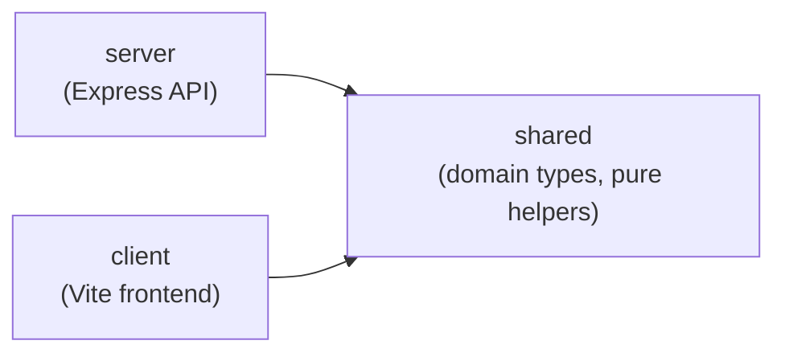

> Generated by /vibe:docs — manual edits will be overwritten; use README for hand-written content.

# Architecture

Kindle Nonograms is an npm workspaces monorepo with three packages.

## `packages/shared`

Domain types and pure helpers used by both the server and the client.

- `CellState` — the type of a single grid cell: `"empty" | "filled" | "marked"`.
- `Puzzle` — a nonogram's definition: `id`, `width`, `height`, `rowClues`, `colClues`.
- `createEmptyGrid(width, height)` — builds a grid of `"empty"` cells with the given dimensions; throws if either dimension is not a positive integer.

## `packages/server`

An Express API. The app is built by a factory function, `createApp()` in `src/app.ts`, kept separate from the code that starts listening (`src/index.ts`). This lets tests exercise the app with `supertest` without opening a real network port.

Currently exposes:

- `GET /api/health` — returns `{ "status": "ok" }`, used as a liveness check.

## `packages/client`

A vanilla TypeScript frontend (no framework), built with Vite. `src/main.ts` mounts into the `#app` element in `index.html`, guarded behind `typeof document !== "undefined"` so pure functions (like `formatClueLine`) stay unit-testable outside a browser.

The Vite build targets `es2015` (see `packages/client/vite.config.ts`) — see [docs/configuration.md](configuration.md) if the target ever needs revisiting for a specific Kindle model's browser.

## Why this split

Kindle's built-in browser is an old WebKit engine, so the client is kept framework-free and compiled to a conservative JS baseline. Domain logic that both the server and the client need (grid/puzzle types) lives in `shared` so the two sides can't drift apart.
